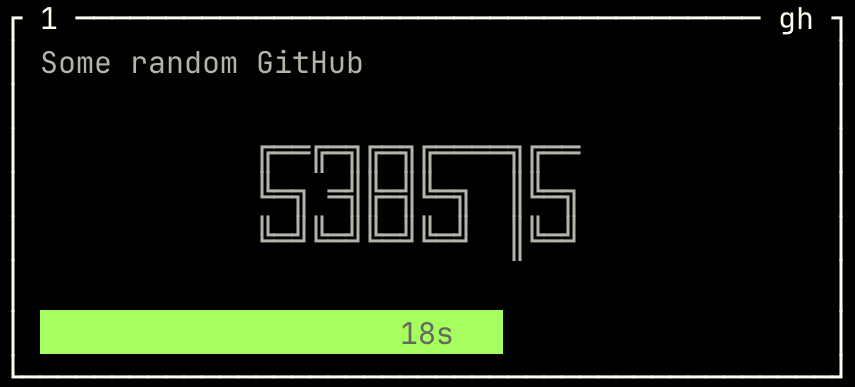
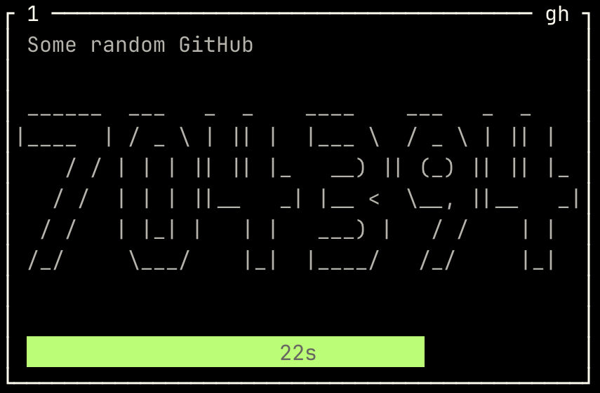

# 🔐 TOTP Generator

**TOTP Generator** is a CLI and HTTP API tool for generating Time-based One-Time Passwords (TOTP)—think *Google Authenticator in your terminal*.

Built in Rust, it's designed to run **offline**, securely, and efficiently even on low-powered devices like a **Raspberry Pi**.

You can output TOTP codes in one or more ways:

* **Console UI**: a fullscreen terminal interface with live-updating tokens.
* **HTTP API**: exposes endpoints like `GET /list` and `GET /token/<handle>`.
* **One-time mode**: print a token directly via CLI with `one-time <handle or index>`.

There is also a mode to generate the config:

* **Configure command**: create a config file from a QR code image (as exported from Google Authenticator).

Other features include:

* lock interface with/out password
* auto-lock after *n* seconds (configurable, can be disabled) or manual lock (Press `l`)
* copy to clipboard (for supported devices: [copypasta](https://github.com/alacritty/copypasta))
* 4 "fonts"
  * Regular text
  * 
  * 
* display how many seconds until each token expires
* concurrent Console UI and HTTP server support

---

## 📦 Requirements

* A JSON-formatted secrets file (see [Secrets Format](#secrets-format)). A sample secrets config can be found under [`examples/config.json`](./examples/config.json)
* Rust (to build from source) - pre-compiled binaries coming soon

---

## 🚀 Usage

```sh
totp-generator <COMMAND> [OPTIONS]
```

For all output commands (anything but `configure`), the secrets file can be read from env `TOTP_SECRETS` or from `--secrets` CLI argument. This is the only required argument.

### 🧽 Commands

#### `one-time`

Generate a one-time code for a specific entry using either its short `handle` or its numeric index in the secrets file.

```sh
totp-generator one-time <TARGET> --secrets <FILE>
```

> ⚠️ If using the `handle` field, avoid numeric strings—they will be interpreted as an index.

#### `interface`

Run the fullscreen UI (default) and/or HTTP API.

```sh
totp-generator interface --secrets <FILE> [--bind <ADDR>] [--no-console] [--port <PORT>] [--lock-after <SECS>] [--number-style <STYLE>]
```

#### `configure`

Create a config file from a QR code image.

```sh
totp-generator configure --from-image <IMAGE> [--prompt] [--origin <ORIGIN>]
```

### 🔧 Global Options

| Flag         | Env Var         | Description                                               |
| ------------ | --------------- | --------------------------------------------------------- |
| `--log-file` | `TOTP_LOG_FILE` | Optional path to log file.                                |
| `--std-err`  |                 | Output logs to stderr. May interfere with the Console UI. |

---

## 📁 Secrets Format

The secrets file must be a valid [JSON](https://www.json.org/) array. Each element is an object representing a TOTP configuration.

### 🗘 Example `config.json`

```json
[
  {
    "name": "Minimum config",
    "secret": "ZBSWY3DPEHPK3PXP"
  },
  {
    "name": "Work Email",
    "handle": "gmail",
    "secret": "ABCD1234EFGH5678",
    "digits": 8,
    "timestep": 60
  }
]
```

Each object supports the following fields:

* `name` *(string, required)*: display name for the secret
* `handle` *(string, optional)*: short identifier used in `one-time` or HTTP modes. Defaults to empty string. **Should not be a numeric string**, to avoid confusion with entry indices.
* `secret` *(string, required)*: the TOTP secret
* `digits` *(number, optional)*: number of digits in the TOTP token. Default: `6`
* `timestep` *(number, optional)*: time interval for TOTP refresh in seconds. Default: `30`

---

## 🖥 Console UI

### `interface` subcommand arguments

* `--secrets <FILE>` *(required)*: Path to the JSON secrets file. Can also be set via the `TOTP_SECRETS` environment variable.
* `--bind <ADDR>` *(optional)*: IP address to bind the HTTP server to. Set this to enable the HTTP API (with or without UI).
* `--no-console` *(flag)*: Disable the console UI and run only the HTTP API.
* `--port <PORT>` *(default: 3000)*: Port to run the HTTP API on.
* `--lock-after <SECONDS>` *(default: 300)*: Number of seconds before the UI auto-locks. Use `0` to disable.
* `--number-style <STYLE>` *(default: standard)*: Number style (`standard`, `pipe`, `lite`, `utf8`).

In `interface` mode with UI enabled, the application launches a fullscreen terminal UI displaying a box for each TOTP entry. Each token auto-refreshes as it expires. The interface can be disabled with the `--no-console` flag.

### 🔲 Box Layout (per entry):

* **Top Left**: Identifier (`0..9`, `a..j`) for clipboard copy.
* **Top Right**: `handle` of the entry (unused in the interface, info only).
* **Center**: The `name` field.
* **Main area**: The current TOTP token.
* **Bottom**: Seconds remaining before expiration.

UI supports auto-lock and manual locking with password unlock if configured.

### ⌨️ Key Bindings

* `0`..`9`, `a`..`j`: Copy token to clipboard
* `q`: Quit
* `l`: Lock manually

### 📋 Other Considerations

* The layout will adapt to the number of secrets, up to 20 entries.
* Secrets file will be automatically reloaded if modified.

---

## 🌐 HTTP API

When run with the `interface` command and a bind address, the program exposes a minimal HTTP API.

### `GET /list`

Returns the list of configured TOTP entries (without secrets).

#### ✅ Response (application/json)

```json
[
  {
    "name": "My GitHub",
    "timestep": 30
  },
  {
    "name": "Work Email",
    "handle": "gmail",
    "timestep": 60
  }
]
```

### `GET /token/<HANDLE OR INDEX>`

Returns the current TOTP token for the given handle or index. You can reference an entry either by its `handle` value (e.g., "gmail") or by its position in the secrets list (e.g., 0 or 1). Just ensure that `handle` values are not numeric strings, as those will be interpreted as indices.

> ⚠️ If using the `handle`, ensure it is not a numeric string, as those will be interpreted as indices—this applies both in the secrets file and when using `one-time` or `/token/<handle>` routes.

The response depends on the `Accept` header:

* `application/json`:

```json
{
  "counter": 1233321, // current linux timestamp / timestep
  "valid_until": 1749415314,
  "token": "846102"
}
```

* Otherwise (text/plain):

```
415314
```

---

## 📌 Examples

Run the UI only:

```sh
totp-generator interface --secrets ./secrets.json
```

Run UI + HTTP API:

```sh
totp-generator interface --secrets ./secrets.json --bind 127.0.0.1
```

Run HTTP only:

```sh
totp-generator interface --secrets ./secrets.json --bind 127.0.0.1 --no-console
```

One-time code using handle "gmail":

```sh
totp-generator one-time gmail --secrets ./secrets.json
```

Disable UI lock:

```sh
totp-generator interface --secrets ./secrets.json --lock-after 0
```

Use pipe style font:

```sh
totp-generator interface --secrets ./secrets.json --number-style pipe
```

Import QR code config:

```sh
totp-generator configure --from-image otp.png
```

---

## 🛠 Building from Source

```sh
git clone https://github.com/matiboy/totp-generator.git
cd totp-generator
cargo build --release
```

## TODO

- [X] Change config according to features
- [ ] Multiple pages when more than 20 items
- [ ] Vertical layout
- [X] Reload configuration on the fly
  - [X] ~Set configuration path from the interface?~
- [X] Allow the number of digits (for the TOTP) to be optionally set on secrets in the `TOML` file
- [X] Concurrent CUI and HTTP API
- [ ] Better Messaging with:
  - [ ] different color for error
  - [ ] disappearing messages
  - [ ] tab or floating view to see all messages
  - [X] Time
- [X] Tracing
  - [X] Tracing to not interfere with TUI
- [X] Create config from a Google Authenticator image

## 📃 License

MIT or Apache-2.0

