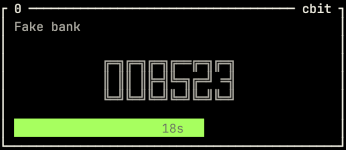
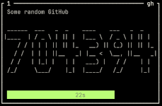

# 🔐 TOTP Generator

**TOTP Generator** is a CLI and HTTP API tool for generating Time-based One-Time Passwords (TOTP)—think *Google Authenticator in your terminal*.

Built in Rust, it's designed to run **offline**, securely, and efficiently even on low-powered devices like a **Raspberry Pi**.


You can output TOTP codes in one or more ways:

* **Console UI**: a fullscreen terminal interface with live-updating tokens.
* **HTTP API**: exposes endpoints like `GET /list` and `GET /code/<name>`.
* **One-time mode**: print a token directly via CLI with `--one-time`.

Other features include:

* lock interface with/out password

* auto-lock after *n* seconds (configurable, can be disabled) or manual lock (Press `l`)

* copy to clipboard (for supported devices: [copypasta](https://github.com/alacritty/copypasta))

* 3 "fonts"

  * 

  * 

* display how many seconds until each token expires

* concurrent Console UI and HTTP server support

---

## 📦 Requirements

* A JSON-formatted secrets file (see [Secrets Format](#secrets-format)). A sample secrets config can be found under `examples/config.json`
* Rust (to build from source) - pre-compiled binaries coming soon

---

## 🚀 Usage

```sh
totp-generator [OPTIONS] --secrets <SECRETS>
```

### 🧽 Modes of Operation

This tool supports running in multiple modes simultaneously:

* **Console UI** *(default)*: Interactive TOTP code viewer with optional lockout.
* **One-time Mode** (`--one-time <YOUR SECRET'S NAME>`): Generates a TOTP for the secret with code or index `<YOUR SECRET'S NAME>`.
* **HTTP API Mode** (`--bind <ADDR>`): Runs a web service for serving generated codes via HTTP.

HTTP mode can run in the background of the console UI, or specify --no-console to run the HTTP API only.

### 🔧 Options

| Flag                 | Env Var         | Description                                                                        |
| -------------------- | --------------- | ---------------------------------------------------------------------------------- |
| `-s`, `--secrets`    | `TOTP_SECRETS`  | **Required.** Path to the [secrets JSON file](#secrets-format).                    |
| `-o`, `--one-time`   |                 | Generate a single TOTP code for a given code or index.                             |
| `-b`, `--bind`       |                 | Launch the HTTP server at the specified address. (required if --no-console is set) |
| `-p`, `--port`       |                 | Port to listen on. Default: `3000`.                                                |
| `-l`, `--lock-after` |                 | Timeout in seconds before UI auto-locks. `0` disables. Default: `300`.             |
| `--number-style`     |                 | Number display style: `standard`, `pipe`, `lite`. Default: `standard`.             |
| `--no-console`       |                 | Run without starting the Console UI.                                               |
| `--log-file`         | `TOTP_LOG_FILE` | Optional path to log file.                                                         |
| `--std-err`          |                 | Output logs to stderr. Usually conflicts with Console UI.                          |

---

## 📁 Secrets Format

The secrets file must be a valid [JSON](https://www.json.org/) document. Each entry represents a TOTP configuration.

### 📝 Example `secrets.json`

```json
[
  {
    "name": "My GitHub",
    "secret": "JBSWY3DPEHPK3PXP"
  },
  {
    "name": "Work Email",
    "code": "gmail",
    "secret": "ABCD1234EFGH5678",
    "digits": 8,
    "timestep": 60
  }
]
```

* `code` is the short identifier used in `--one-time` or HTTP modes.
* `digits` (optional): number of digits in the TOTP token. Default: `6`
* `timestep` (optional): time interval for TOTP refresh. Default: `30`

A sample secrets config can be found under `examples/config.json`

---

## 🖥 Console UI


In default mode, the application launches a fullscreen terminal UI displaying a box for each TOTP entry. Each token auto-refreshes as it expires.

### 🔲 Box Layout (per entry):

* **Top Left**: Identifier (`0..9`, `a..j`) for  clipboard copy.
* **Top Right**: `code` of the entry.
* **Center**: The `name` field.
* **Main area**: The current TOTP token.
* **Bottom**: Seconds remaining before expiration.

UI supports auto-lock and manual locking with password unlock if configured.

### ⌨️ Key Bindings

* `0`..`9`, `a`..`j`: Copy token to clipboard
* `q`: Quit
* `l`: Lock manually

### 📋 Other Considerations

* The layout will adapt to the number of secrets, up to 20 entries.

* Secrets file will be automatically reloaded if modified.

---

## 🌐 HTTP API

When run with the `--bind` option, the program exposes a minimal HTTP API.

### `GET /list`

Returns the list of configured TOTP entries (without secrets).

#### ✅ Response (application/json)

```json
[
  {
    "name": "My GitHub",
    "timestep": 30
  },
  {
    "name": "Work Email",
    "code": "gmail",
    "timestep": 60
  }
]
```

### `GET /code/<YOUR SECRET'S CODE>`

Returns current TOTP token for the given code.

The response depends on the `Accept` header:

* `application/json`:

```json
{
  "timestamp": 1749415312,
  "valid_until": 1749415314,
  "token": "846102"
}
```

* Otherwise (text/plain):

```
415314
```

#### ✅ Example:

```sh
curl http://localhost:3000/code/gmail
```

---

## 📌 Examples

Start UI + API on default port (3000):

```sh
totp-generator --secrets ./secrets.json --bind 127.0.0.1
```

Run HTTP only (no UI):

```sh
totp-generator --secrets ./secrets.json --bind 127.0.0.1 --no-console
```

One-time code using code "gmail":

```sh
export TOTP_SECRETS=$HOME/.google_authenticator.json
totp-generator --one-time gmail
```

Disable UI lock:

```sh
totp-generator --secrets ./secrets.json --lock-after 0
```

Use pipe style font:


```sh
totp-generator --secrets ./secrets.json --number-style pipe
```

A sample secrets config can be found under `examples/config.json`

---

## 🛠 Building from Source

```sh
git clone https://github.com/matiboy/totp-generator.git
cd totp-generator
cargo build --release
```

## TODO

- [ ] Change config according to features
- [ ] Multiple pages when more than 20 items
- [ ] Vertical layout
- [ ] Reload configuration feature
  - [ ] Set configuration path from the interface?
- [X] Allow the number of digits (for the TOTP) to be optionally set on secrets in the `TOML` file
- [X] Concurrent CUI and HTTP API
- [ ] Better Messaging with:
  - [ ] different color for error
  - [ ] disappearing messages
  - [ ] tab or floating view to see all messages 
- [X] Tracing
  - [ ] Tracing to not interfere with TUI

## 📃 License

MIT or Apache-2.0


